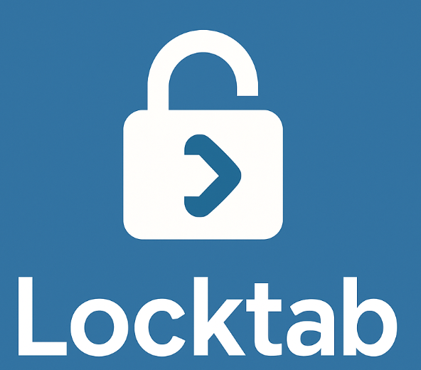

# Locktab

**Simple and secure password lock for your code editor**

Protect your workspace with a customizable password screen. Perfect for shared computers, office environments, or when you need to step away from your desk.

---

## Quick Start

1. **Install** → Search "Locktab" in Extensions
2. **Set Password** → Extension will ask for a password on first run
3. **Done!** → Your editor will now lock automatically on startup

---

## How to Use

### First Time Setup
When you install Locktab, it will automatically:
- Ask you to create a password
- Lock your editor immediately (if you choose)

### Locking Your Editor
**Automatic:** Editor locks every time you open it  
**Manual:** Press `Ctrl+Shift+P` → type "Lock Editor Now"

### Unlocking Your Editor
Just enter your password in the lock screen and press Enter!

---

## Settings

Open Settings (`Ctrl+,`) and search for "Locktab":

| Setting | Description | Default |
|---------|-------------|---------|
| **Password** | Your lock password | *(empty)* |
| **Lock on Startup** | Auto-lock when editor opens | Enabled |

---

## Need Help?

### Forgot Your Password?
1. **Easy way:** Go to Settings → search "locktab" → clear password field → restart editor
2. **Command way:** Press `Ctrl+Shift+P` → "Disable Locktab" → restart editor

### Want to Change Password?
Press `Ctrl+Shift+P` → "Set Password" → enter new password

### Want to Disable?
Press `Ctrl+Shift+P` → "Disable Locktab"

### Want to Re-enable?
Press `Ctrl+Shift+P` → "Enable Locktab"

---

## Commands

All commands available in Command Palette (`Ctrl+Shift+P`):

- `Lock Editor Now` - Lock immediately
- `Set Password` - Change your password
- `Enable Locktab` - Turn on password protection
- `Disable Locktab` - Turn off password protection

---

## Security Notes

- Zero dependencies for maximum security
- Password stored in editor settings (encrypted with Settings Sync)
- Works offline
- For workspace protection, not enterprise-grade security
- Use a strong, memorable password

---

## Features

- **Dark Theme** - Matches your editor perfectly
- **Escape Proof** - Can't bypass with keyboard shortcuts
- **Auto-Restore** - Reopens if accidentally closed
- **Lightweight** - No impact on editor performance
- **Simple** - Just works!

---

## License

MIT License - Free and open source

---

## Support

Having issues? Found a bug? Want a feature?

Open an issue on [Linkedin](https://www.linkedin.com/in/burakkanber1/)

---

**Developed by datkanber for users who value privacy and security**
